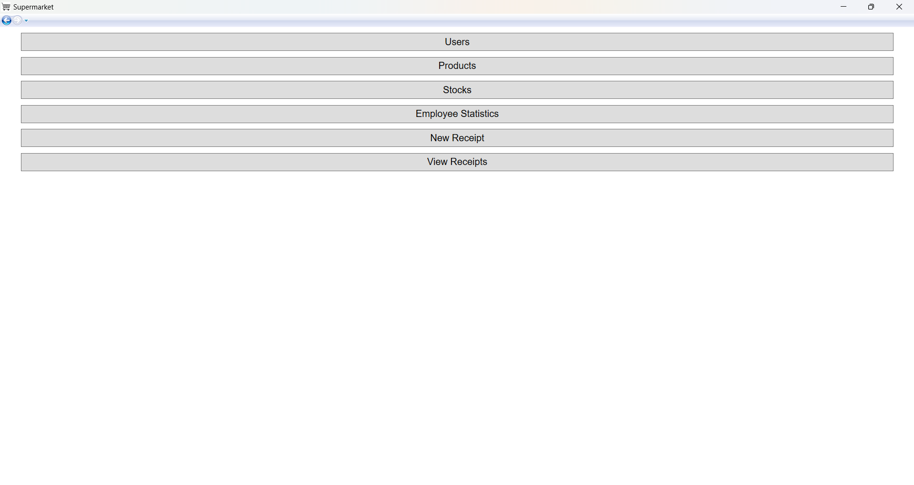
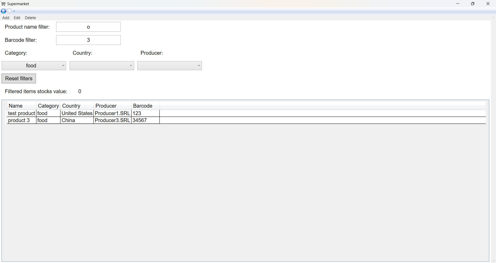
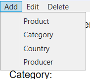
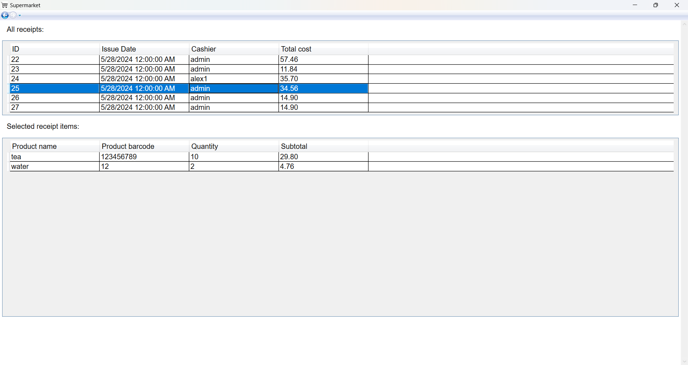
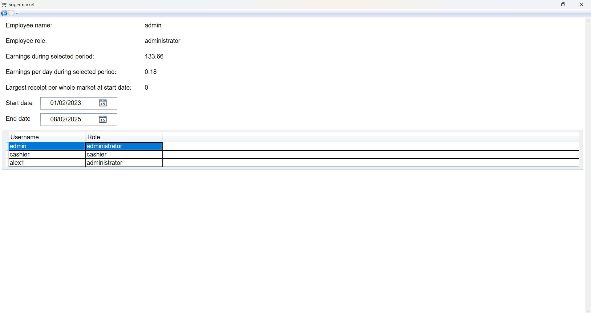

# Supermarket

## Overview

A WPF Application that simulates multiple roles in a supermarket: administrator and cashier. It uses a relational SQL Server database as its persistent storage and the built-in SqlClient classes. The app implements the MVVM design pattern by leveraging concepts like property binding, converter, command.

## Screenshots

## Features

- 2 roles: admin and cashier
- password hashing
- stored procedures
- product search filters with LINQ
- full receipt history
- table views
- data caching

## Description

The complete functionalities of the roles is available in the [Roles section](#roles). The following description is based on the admin role.

When they enter the app, the user will firstly be prompted for a username, a password and a role to log in with. If the details are correct, the user will be shown the main menu. Here the user can enter any page and find more details about topics, inspect, create, edit and delete data from the database. Changes will be made visible in real time. In particular, the user has access to the products, the stocks, the receipts, and all the other database tables.

The data is fetched and changed using stored procedures, handwritten and saved in the SQL folder in the root directory of the project. Once brought into the application, data is cached and reused throughout the duration of the process.

The application is structured on multiple layers of access and functionality:

- model layer
  - entities layer - maps of the database tables to C# classes
  - data access layer - accesses the database server using entities
  - business logic layer - uses the data access layer for the logic of the application
- view model layer
  - converters
  - commands
  - view model data classes - map entity classes to view models that can be used for property binding
  - view model XAML classes - the data behind XAML files
- view layer
  - the XAML files describing pages / windows

## Roles

| Action                  | Admin | Cashier |
| ----------------------- | ----- | ------- |
| Log in                  | ✅    | ✅      |
| See all users           | ✅    | ❌      |
| Create a user           | ✅    | ❌      |
| Delete a user           | ✅    | ❌      |
| Edit a user             | ✅    | ❌      |
| See all products        | ✅    | ✅      |
| Create a product        | ✅    | ❌      |
| Delete a product        | ✅    | ❌      |
| Edit a product          | ✅    | ❌      |
| See all categories      | ✅    | ✅      |
| Create a category       | ✅    | ❌      |
| Delete a category       | ✅    | ❌      |
| Edit a category         | ✅    | ❌      |
| See all countries       | ✅    | ✅      |
| Create a country        | ✅    | ❌      |
| Delete a country        | ✅    | ❌      |
| Edit a country          | ✅    | ❌      |
| See all producers       | ✅    | ✅      |
| Create a producer       | ✅    | ❌      |
| Delete a producer       | ✅    | ❌      |
| Edit a producer         | ✅    | ❌      |
| See all stocks          | ✅    | ✅      |
| Create a stock          | ✅    | ❌      |
| Delete a stock          | ✅    | ❌      |
| Edit a stock            | ✅    | ❌      |
| See all receipts        | ✅    | ✅      |
| Create a receipt        | ✅    | ✅      |
| See employee statistics | ✅    | ❌      |
